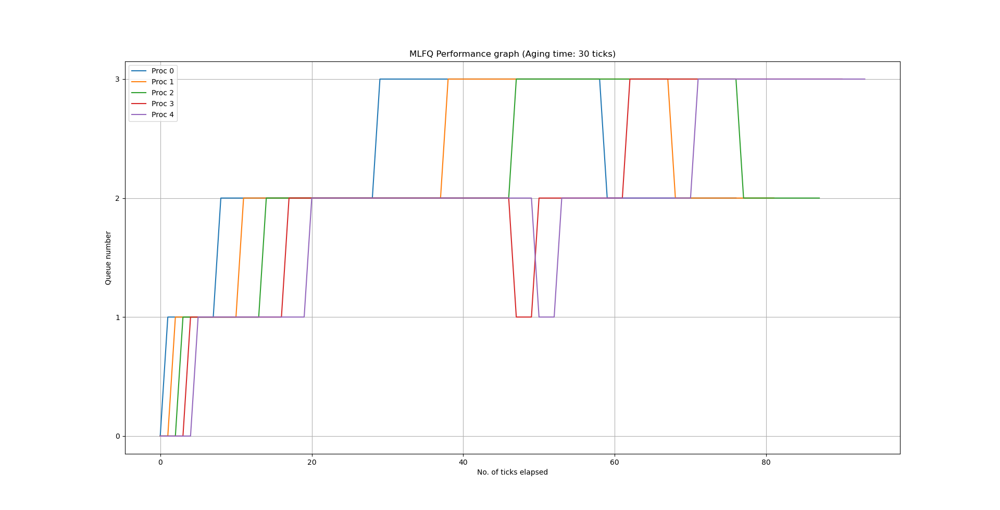

# Report
This document describes the implementation of the specifications as mentioned in the assignment.

## Specification 2: Scheduling
- Modified Makefile to take argument which then defines a macro with the compiler to identify the scheduling policy

### FCFS Policy
- Have checked the `ctime` variable in the `struct proc` which stores the time a process was created.
- We then find the process with the least `ctime` and schedule it 

### MLFQ Policy
- Created a new `struct mlfq_data` in `struct proc` to store the details needed by the MLFQ schduler. (like as current queue number, number of ticks waited in the current queue, time at which it was added to the queue and time spent in each queue)
- Edited `allocproc()` to initialise the new struct created
- Made a virtual queue system where each queue is identified by its `curr_pri` and `in_queue`. The ordering is maintained by the `intime` variable which stores the time at which the process was added to the queue.
- Edited `scheduler()` to boost and demote processes, and then, run the process with the highest priority
- Edited `update_time()` to update runtime, wait time and num of ticks
- Edited `kerneltrap()` and `usertrap()` to yield when process has exhausted its time slice. Aging is also handled. 

- **Benchmarking**

  |         Scheduler         |  rtime |  wtime  |
  | :----------------------- | -----:| :----: |
  |        Round robin        |    9   |   137   |
  |  First come first serve   |   10   |   104   |
  | Multilevel Feedback queue |    9   |   133   |

  The above results are obtained by running `schedulertest` on a single CPU.

## MLFQ time plot
Below is a graph that depicts the changes a process goes through as it is scheduled by the MLFQ scheduler.

Note that IO bound processes aren't included as they remain in queue 0 for the entire time.

